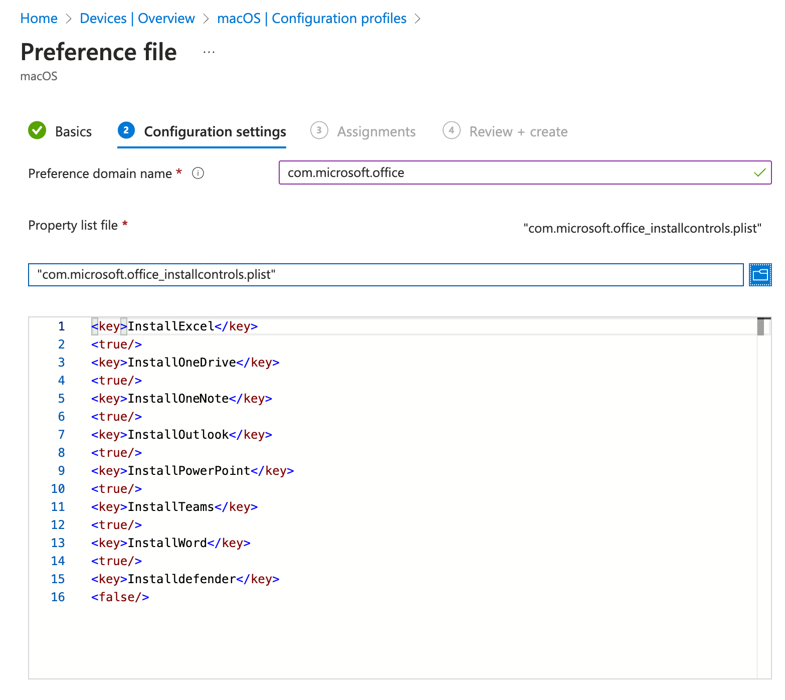

# Scripts for Microsoft Office for Mac

These scripts provide examples of how to use [Intune Shell Scripting](https://docs.microsoft.com/en-us/mem/intune/apps/macos-shell-scripts) to deploy Microsoft Office for Mac

Our recommended method of deploying Office for Mac is to use the [Apple Volume Purchase Program](https://docs.microsoft.com/en-us/mem/intune/apps/vpp-apps-ios) feature within Microsoft Intune. This can be used to individually select the Microsoft Office apps, they'll update automatically via the Mac App Store and automatically be cached if you have a local [Apple Asset Cache](https://support.apple.com/en-gb/guide/mac-help/mchl9388ba1b/mac). Additionally, this method is compatible with macOS 11's 'Managed App' feature coming to Big Sur.

Common scenarios where these scripts might be used:

- Needing to deploy a specific version of Office to some Macs
- Needing to control the update channel for some users (InsiderFast, Slow etc). Note that the apps deployed via VPP will always be the Production channel)
- Needing to control how the Microsoft Autoupdate App is configured. Note that apps delivered via VPP do not use MAU.
- Needing to remove OfficeBusinessPro
- Installing Outlook Support Tools (OutlookResetPreferences, OutlookResetRecentAddresses and OutlookAsDefaultMailClient)

## installOffice365Pro
This script will check the version of macOS and then install the latest available build of Office365, including Teams.

## installOffice365Pro_individual
This script loops through an array and will attempt to download and install the latest version of each app listed.

## MAU Plist
This folder contains sample plist files to be deployed via the Intune Preferences feature that will control how the Microsoft Autoupdate tool behaves

## Outlook
This folder contains some sample scripts that might be helpful for Outlook controls, such as setting it as the default e-Mail client.

## Install Controls (skip defender shim)
The Office Business Pro suite allows you to control which applications get installed via an [Intune managed preferences file](https://learn.microsoft.com/en-us/mem/intune/configuration/preference-file-settings-macos). You can start with the example **com.microsoft.office_installcontrols.plist** and modify as required.

You can find more information in the [Office for Mac deployment documentation](https://learn.microsoft.com/en-us/deployoffice/mac/preferences-office#excluding-apps)

You should set the Preference domain name for this managed preference file to : **com.microsoft.office**

Note: The Office Business Pro suite includes a shim for Defender. If you are not using Defender in your environment, you can prevent this from being installed by using this preference file with InstallDefender to to false. 

